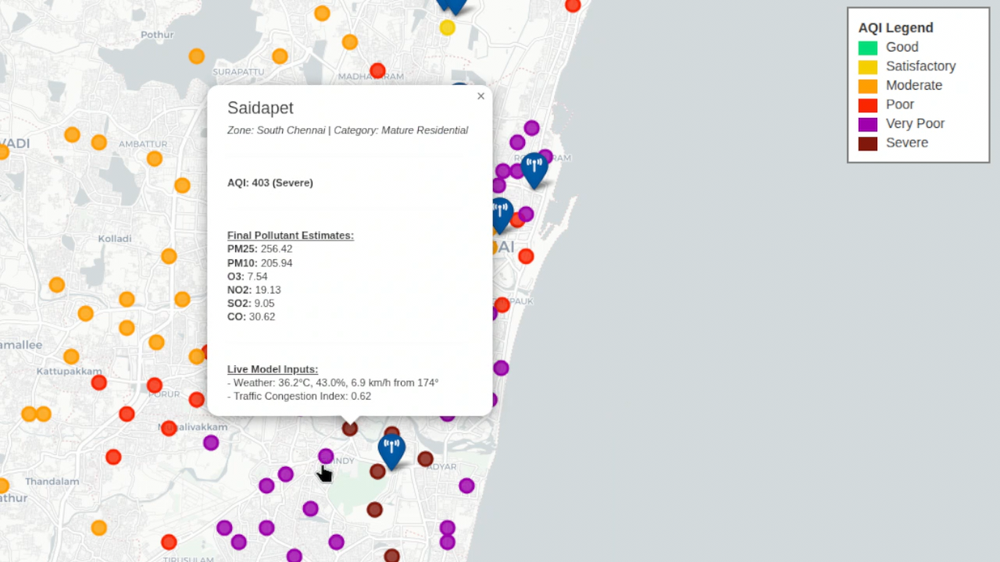

# HyperlocalAQ: A High-Resolution, Multi-Source Air Quality Modeling Framework

[](https://opensource.org/licenses/MIT)


`HyperlocalAQ` is an open-source Python framework I developed to generate high-resolution, neighborhood-level air quality estimates. It addresses the critical challenge of data scarcity from official monitoring stations by intelligently fusing data from a diverse set of public sources.

The result is a granular, interactive map that reveals the micro-environmental variations in air pollution across a city, providing valuable insights for researchers, urban planners, and citizens.



---

## The Problem: Data Gaps in Air Quality Monitoring

Official air quality monitoring stations provide accurate, reliable data, but they are expensive to deploy and maintain. Consequently, most cities have only a handful of stations, leaving vast areas unmonitored. This creates a significant data gap, as air pollution can vary dramatically over short distances due to factors like traffic, local industry, and geography. Relying on data from a distant station can lead to a significant misrepresentation of an individual's actual pollution exposure.

## My Approach: A Multi-Layered Data Fusion Model

`HyperlocalAQ` solves this problem by implementing a sophisticated, multi-stage data fusion pipeline that I designed. Instead of relying on a single source, it builds a comprehensive picture of air quality by layering and adjusting data from multiple inputs.

The core methodology is as follows:

1.  **Hybrid Baseline Estimation:** The model first calculates a baseline pollution value for every target location. This is not a simple interpolation. It's a **Hybrid Inverse Distance Weighting (IDW)** calculation that combines:
    *   **Sparse, accurate data** from the nearest official ground stations (via the WAQI API).
    *   **Spatially complete but less precise data** from the Copernicus Atmosphere Monitoring Service (CAMS) satellite model, which acts as a "virtual station" to provide a baseline everywhere.

2.  **Meteorological Adjustment:** Air quality is heavily influenced by weather. The baseline estimate is adjusted using real-time, hyper-local meteorological data (from Open-Meteo) for wind speed, wind direction, temperature, and humidity. For example, low wind speeds can increase pollutant concentration, while certain wind directions can bring in cleaner or more polluted air.

3.  **Dynamic Fire Impact:** Smoke plumes from wildfires or agricultural burning can drastically affect regional air quality. The model fetches active fire hotspots from **NASA's FIRMS database**, calculates their potential downwind impact based on fire radiative power (FRP) and wind direction, and adjusts pollutant levels accordingly.

4.  **Local Source Adjustment:** Finally, the model refines the estimate by considering hyper-local pollution sources:
    *   **Static Sources:** It queries **OpenStreetMap** for nearby industrial zones, power plants, landfills, and major highways, applying a capped adjustment factor based on proximity.
    *   **Dynamic Traffic:** It fetches real-time traffic congestion data from the **TomTom API** and adjusts traffic-related pollutants like NO₂ and CO based on current road conditions.

The final output is a robust, scientifically-grounded estimate of air quality at a neighborhood scale.

### System Architecture


---

## Installation Guide

To run `HyperlocalAQ`, you will need Python 3.8+ and Git.

1.  **Clone the Repository**
    Open your terminal and clone this repository to your local machine:
    ```bash
    git clone https://github.com/your-username/hyperlocal-aq-model.git
    cd hyperlocal-aq-model
    ```

2.  **Set Up a Virtual Environment (Recommended)**
    It's best practice to create a virtual environment to manage project dependencies.
    ```bash
    # For macOS/Linux
    python3 -m venv venv
    source venv/bin/activate

    # For Windows
    python -m venv venv
    .\venv\Scripts\activate
    ```

3.  **Install Dependencies**
    Install all the required Python libraries using the `requirements.txt` file:
    ```bash
    pip install -r requirements.txt
    ```

---

## Configuration: API Keys

This framework relies on several external APIs. You must obtain your own free API keys and add them to the script.

Open the `aqi_model.py` file and update the following lines with your keys:

```python
# --- API & File Configuration ---
WAQI_API_TOKEN = "YOUR_WAQI_TOKEN_HERE"
NASA_FIRMS_API_KEY = "YOUR_FIRMS_KEY_HERE"
TOMTOM_API_KEY = "YOUR_TOMTOM_KEY_HERE"
